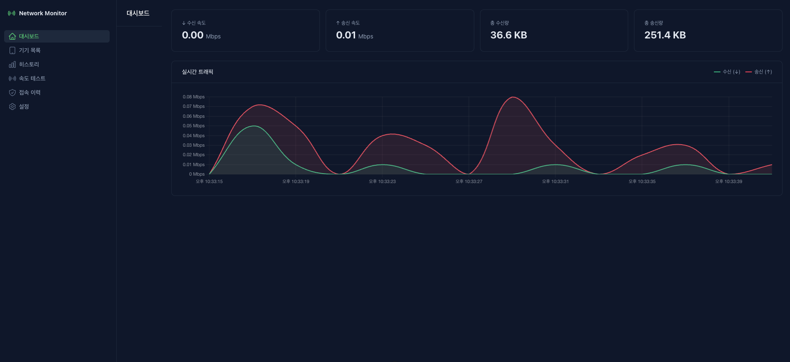
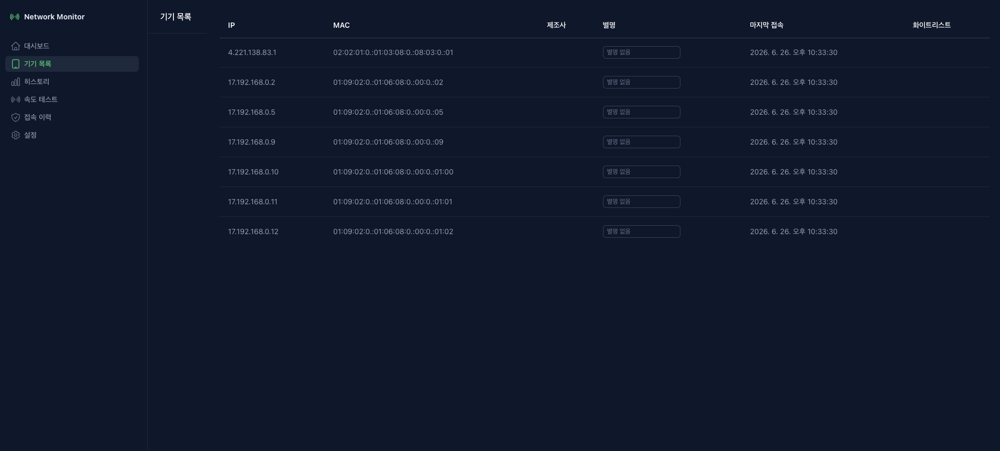
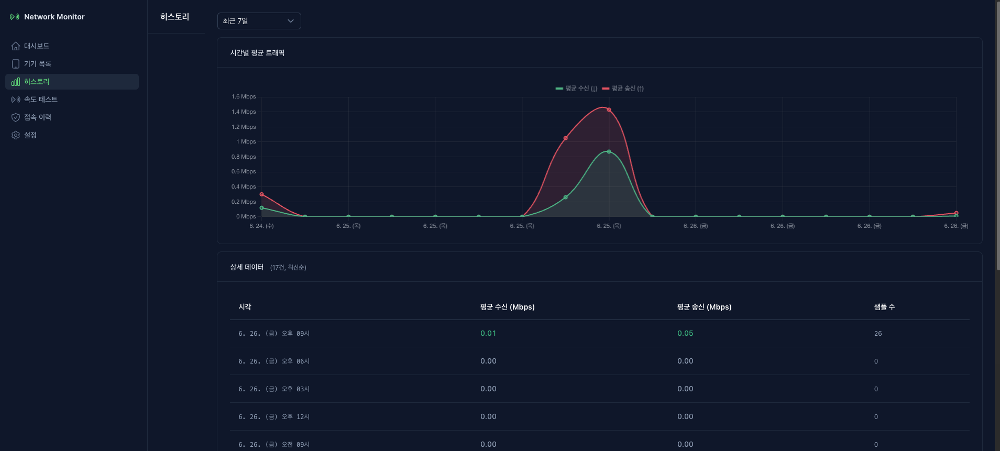
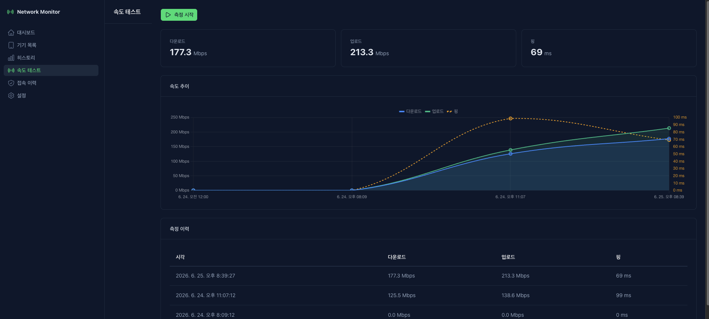
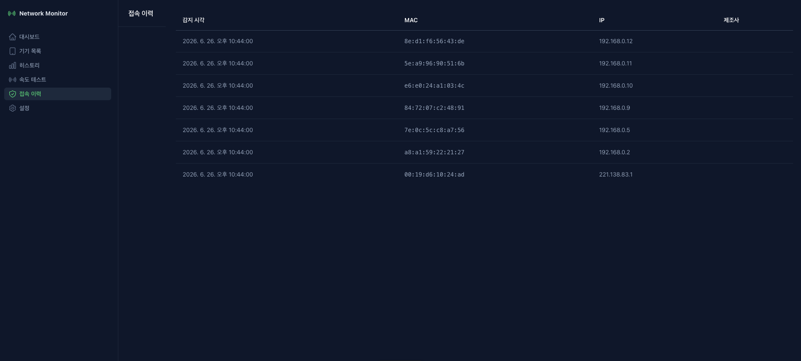
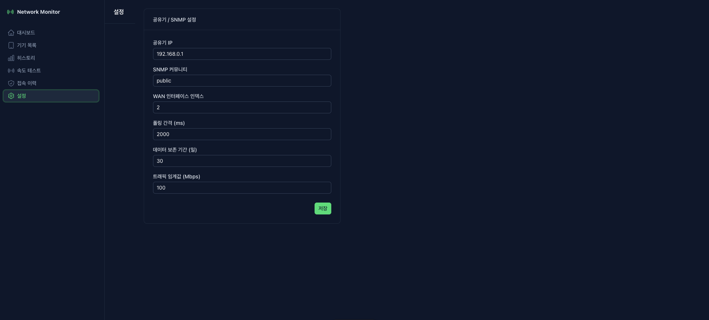

# 홈 네트워크 모니터

ipTIME 공유기의 SNMP 인터페이스를 활용해 가정 내 네트워크 트래픽을 실시간으로 수집·시각화하는 웹 대시보드입니다.

> 개인 포트폴리오 프로젝트 — Mac Mini M4 Pro 자체 호스팅

---

## 주요 기능

| 기능 | 설명 |
|---|---|
| 실시간 트래픽 | SNMP 2초 폴링, WAN IN/OUT 속도 라인 차트 (최근 60포인트) |
| 기기 목록 | ARP 테이블 스캔으로 연결 기기 탐지, MAC OUI 제조사 추정, 별명 지정 |
| 신규 기기 감지 | 미등록 기기 접속 시 즉시 감지 및 이벤트 로그, 화이트리스트 관리 |
| 히스토리 | Elasticsearch 저장, 기간별(1h/6h/24h/7d) 차트 + 테이블 조회 |
| 속도 테스트 | Cloudflare 서버 기반 DL/UL/핑 측정, 이력 차트 및 테이블 |
| 데이터 정리 | 설정한 보존 기간이 지난 데이터 매일 새벽 3시 자동 삭제 |

---

## 기술 스택

```
Frontend   Nuxt 4 + Vue 3 + Nuxt UI v4 + Chart.js
Backend    NestJS 11 (TypeScript)
SNMP       net-snmp (UDP 161, 2초 폴링)
실시간     WebSocket (ws 라이브러리, /ws 경로)
DB         Elasticsearch 8.13
배포       Docker Compose + Nginx
```

---

## 시스템 아키텍처

```
[ ipTIME 공유기 ]
     SNMP (UDP 161)
          ↓ 2초 폴링
[ NestJS 백엔드 :4000 ]
  ├─ SnmpService     → traffic.rate 이벤트
  ├─ ArpService      → 30초마다 ARP 테이블 스캔
  ├─ ElasticService  → traffic-logs / device-logs / speedtest-results 저장
  ├─ SpeedtestService → Cloudflare 속도 측정 (수동 + 매일 자정)
  ├─ RetentionService → 오래된 데이터 자동 삭제 (매일 새벽 3시)
  └─ WsGateway       → 브라우저로 실시간 Push

[ Nginx :80 ]
  ├─ /       → frontend :3000
  ├─ /api/*  → backend  :4000
  └─ /ws     → backend  :4000 (WebSocket)

[ Nuxt 프론트엔드 :3000 ]
  ├─ /           대시보드 (실시간 차트 + 속도 카드)
  ├─ /devices    기기 목록 (별명·화이트리스트 편집)
  ├─ /history    트래픽 히스토리 (차트 + 테이블)
  ├─ /speedtest  속도 테스트
  ├─ /events     신규 기기 접속 이력
  └─ /settings   SNMP·보존 기간 설정
```

---

## 사전 준비

### 1. ipTIME SNMP 활성화

공유기 관리 페이지(`http://192.168.0.1`) → **고급 설정 → 관리도구 → SNMP 설정**에서 SNMP를 활성화합니다.

```bash
# 활성화 확인
brew install net-snmp
snmpwalk -v2c -c public 192.168.0.1 sysDescr
```

### 2. WAN 인터페이스 인덱스 확인

```bash
snmpwalk -v2c -c public 192.168.0.1 1.3.6.1.2.1.2.2.1.2
# 출력 예시
# IF-MIB::ifDescr.1 = STRING: lo
# IF-MIB::ifDescr.2 = STRING: eth0  ← WAN 포트
```

WAN 포트의 숫자(`2` 등)가 `SNMP_IF_INDEX` 값입니다.

### 3. 환경변수 설정

```bash
cp .env.example .env
```

`.env` 파일에서 아래 값을 실제 환경에 맞게 수정합니다.

| 변수 | 기본값 | 설명 |
|---|---|---|
| `ROUTER_IP` | `192.168.0.1` | 공유기 IP |
| `SNMP_COMMUNITY` | `public` | SNMP 커뮤니티 문자열 |
| `SNMP_IF_INDEX` | `2` | WAN 인터페이스 인덱스 |
| `POLL_INTERVAL_MS` | `2000` | 폴링 간격 (ms) |
| `ES_NODE` | `http://elasticsearch:9200` | Elasticsearch 주소 |
| `PORT` | `4000` | 백엔드 포트 |

---

## 실행

### Docker Compose (권장)

```bash
# 전체 빌드 및 실행 (frontend / backend / elasticsearch / nginx)
docker compose up -d --build

# 로그 확인
docker compose logs -f backend
docker compose logs -f elasticsearch

# 종료
docker compose down

# 데이터 포함 전체 초기화
docker compose down -v
```

실행 후 `http://Mac-Mini-IP` 로 접속합니다.

### 로컬 개발

```bash
# 백엔드
cd apps/backend
cp .env.example .env   # .env 값 수정
npm install
npm run start:dev

# 프론트엔드 (별도 터미널)
cd apps/frontend
npm install
npm run dev            # http://localhost:3000
```

> 로컬 개발 시 `NUXT_PUBLIC_API_URL=http://localhost:4000`, `NUXT_PUBLIC_WS_URL=ws://localhost:4000/ws` 로 설정합니다.

---

## Elasticsearch 인덱스

| 인덱스 | 내용 |
|---|---|
| `traffic-logs` | 2초마다 IN/OUT Bps 저장 |
| `device-logs` | 신규 기기 감지 이벤트 |
| `speedtest-results` | 속도 테스트 결과 |

인덱스는 백엔드 최초 실행 시 자동 생성됩니다.

```bash
# 상태 확인
curl http://localhost:9200/_cluster/health
curl http://localhost:9200/_cat/indices?v
```

---

## WebSocket 이벤트

| 이벤트 | 페이로드 |
|---|---|
| `traffic` | `{ timestamp, inBps, outBps, totalIn, totalOut }` |
| `devices` | `{ devices: [...] }` |
| `new_device` | `{ mac, ip, vendor, detectedAt }` |
| `speedtest_result` | `{ download, upload, ping, timestamp }` |
| `error` | `{ message }` |

---

## 구현 화면

### 대시보드
실시간 WAN IN/OUT 트래픽 차트 및 속도 카드



### 기기 목록
ARP 스캔으로 탐지된 연결 기기, 별명·화이트리스트 관리



### 트래픽 히스토리
기간별(1h/6h/24h/7d) 트래픽 차트 + 테이블 조회



### 속도 테스트
Cloudflare 기반 DL/UL/핑 측정 및 이력 차트



### 신규 기기 접속 이력
미등록 기기 감지 이벤트 로그



### 설정
SNMP 파라미터 및 데이터 보존 기간 설정


